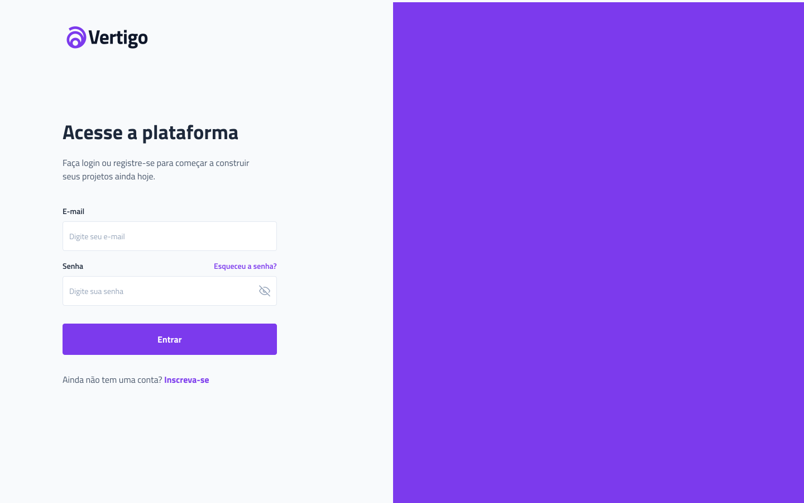

# #boraCodar_Vertigo

## Descrição 

O objetivo do desafio proposto pela

[<i>RocketSeat</i>](https://www.rocketseat.com.br/)
 : construção de uma tela de login

## Layout da aplicação

## Tecnologías utilizadas: 
<li>React</li>
<li>Vite</li>
<li>TypeScript</li>
<li>JavaScript</li>
<li>Node.js</li>
<li>Styled-Components</li>

[<i>Deploy da aplicação</i>](https://bora-codar-vestigo.vercel.app)

